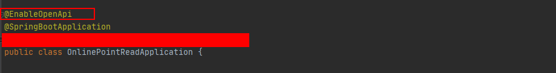

1. 引入jar包
```
 <!--   swagger     -->
        <dependency>
            <groupId>io.springfox</groupId>
            <artifactId>springfox-boot-starter</artifactId>
            <version>3.0.0</version>
        </dependency>
```
2. 主类加上`@EnableOpenApi`
    
    
3. 加入swagger配置文件
```
@Configuration
public class SwaggerConfig {
    @Bean
    public Docket createRestApi() {
        return new Docket(DocumentationType.OAS_30)
                .apiInfo(apiInfo())
                .select()
                .apis(RequestHandlerSelectors.withMethodAnnotation(ApiOperation.class))
                .paths(PathSelectors.any())
                .build();
    }

    private ApiInfo apiInfo() {
        return new ApiInfoBuilder()
                .title("X02在线点读接口文档")
                .description("文档描述")
                .contact(new Contact("步步高教育电子有限公司", "", "eebbk"))
                .version("1.0")
                .build();
    }
}
```
4. controller、model等加上注解
```
@Api(value = "测试类")
@RestController
@RequestMapping(value = "test")
public class TestController {


    @ApiOperation(value = "测试接口", notes = "something")
    @GetMapping("test")
    public String test(@ApiParam(value = "名字")String name){
        return "hello world, " + name;
    }

}
```
5. 输入 `http://127.0.0.1:port/swagger-ui.html`验证
    